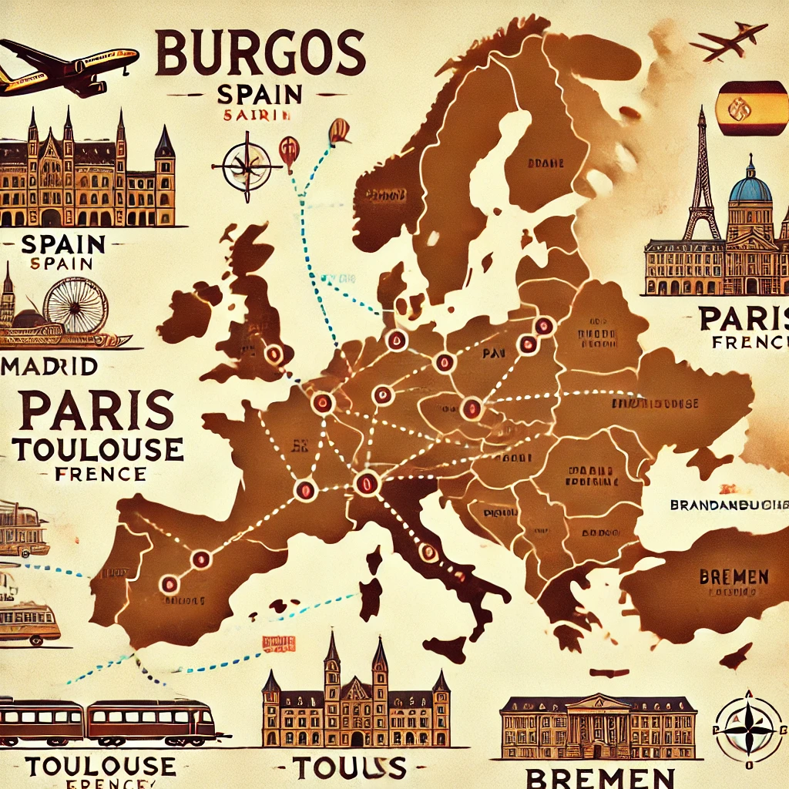

# ✈️ Planificación de Viaje por Europa

  

## 📌 Descripción
Este repositorio se utilizará para planificar y organizar nuestro viaje por Europa. Aquí gestionaremos itinerarios, transporte, alojamiento y cualquier otro detalle relevante para que el viaje sea lo más cómodo y eficiente posible.

## 🗺️ Itinerario 

1. **Salida desde Burgos** → Madrid ✈️
   - Transporte: Bus a Madrid
   - Vuelo desde Madrid a París

2. **París (2 días / 1 noche)** 🇫🇷
   - Visitas: Torre Eiffel, Louvre, Notre-Dame, etc.
   - Alojamiento: 📍 Cercano a la Torre Eiffel
   - Transporte: Metro y bus

3. **Toulouse (1 día / 1 noche)** 🇫🇷
   - Transporte: Vuelo desde París
   - Visitas: Plaza del Capitolio, Canal du Midi, etc.
   - Alojamiento: 📍 Cercano a la catedral

4. **Bremen (3 días / 3 noches)** 🇩🇪
   - Transporte: Vuelo desde Toulouse
   - Visitas: Plaza del Mercado, Roland, Barrio Schnoor, etc.
   - Alojamiento: 📍 Cercano a la Plaza del Mercado

5. **Regreso a Madrid (1 noche)** 🇪🇸
   - Transporte: Vuelo desde Bremen
   - Alojamiento: 📍 Cercano al aeropuerto 

6. **Vuelta a Burgos** 🏡
   - Transporte: Bus desde Madrid

## 📂 Organización del Repositorio
Este repositorio está estructurado en **milestones** para facilitar la planificación y el seguimiento del viaje:

- 🛑 **Problemas** → Posibles inconvenientes que puedan surgir y sus soluciones.
- 🏙️ **Planes por las ciudades** → Organización de actividades en cada destino.
- 📋 **Gestión del viaje** → Actividades y tareas a realizar antes y durante el viaje.
- 🗺️ **Itinerario** → Lugares y paradas a visitar.
- 💰 **Costes** → Presupuesto del viaje (billetes, comidas, alojamiento, transporte, etc.).

Cada milestone tiene tareas asociadas para garantizar que el viaje esté bien organizado.

## 📌 Notas
- Todos los detalles se irán actualizando en este repositorio.

¡Listas para la aventura! 🌍✨

